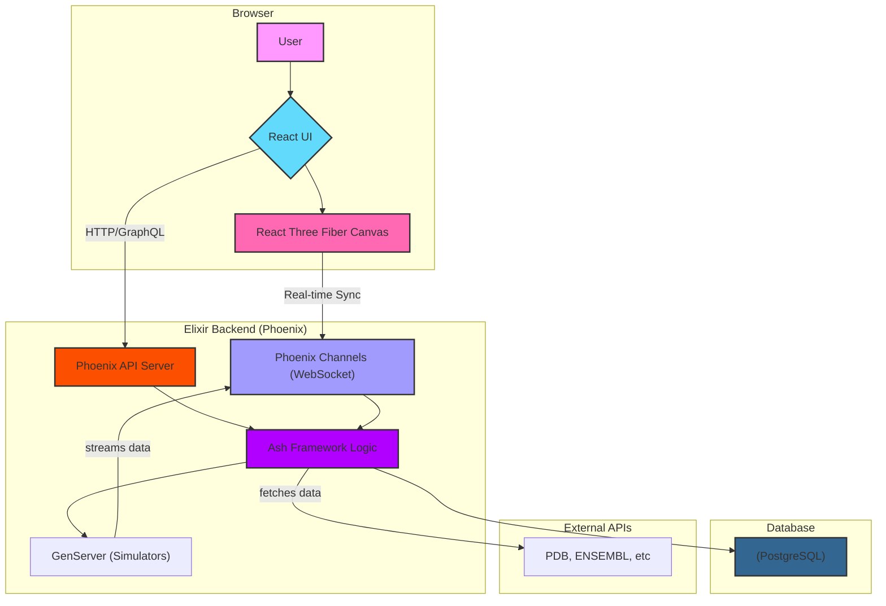

# Nucleic

> A real-time, collaborative 3D workbench for bioinformatics, visualizing DNA, protein folding, and molecular docking.

[](https://opensource.org/licenses/MIT)
[](https://github.com/LuVerissimo/Nucleic/actions)

Nucleic is an all-in-one web platform designed for biologists, chemists, and researchers to interact with complex biomolecular data in a shared 3D space.

---

## Key Features

* Real-Time Collaboration: Share a 3D scene with your team. Move, rotate, and analyze models together, with all changes synced instantly to every user.
* Genomic Data Browser: Fly through a massive, dynamically-loaded 3D model of a DNA helix. View annotations, genes, and other data streamed in real-time from the backend.
* Protein Folding Visualizer: Watch protein folding simulations unfold in real-time as the backend computes and streams coordinate data.
* Collaborative Molecular Docking: Load a protein structure and test different ligands. See simulation results animated live, and discuss findings with collaborators in the same 3D view.

---

## Tech Stack

The project is built with a real-time, scalable, and modern stack.

| Role | Technology | Why? |
| :--- | :--- | :--- |
| **Backend** | [**Elixir**](https://elixir-lang.org/) & [**Phoenix**](https://www.phoenixframework.org/) | For massive concurrency and real-time state synchronization via Phoenix Channels. |
| **App Logic** | [**Ash Framework**](https://www.ash-hq.org/) | For declarative domain modeling, auto-generated APIs (GraphQL), and robust business logic. |
| **Frontend** | [**React**](https://reactjs.org/) | For a modern, component-based user interface. |
| **3D Rendering**| [**React Three Fiber**](https://docs.pmnd.rs/react-three-fiber) | For high-performance, declarative 3D scenes using `three.js` inside React. |
| **Database** | [**PostgreSQL**](https://www.postgresql.org/) | A powerful and reliable relational database. |

---

## Architecture

*(This diagram will be populated in a later step. For now, it's a great placeholder)*




Getting Started

Prerequisites
Elixir ~1.15

Phoenix ~1.7

Node.js ~20.x (with npm or yarn)

PostgreSQL 14+

1. Clone the repository
```Bash

git clone [https://github.com/LuVerissimo/](https://github.com/LuVerissimo/)[Nucleic].git
cd [Nucleic]
```
2. Backend Setup (Elixir)
```Bash

# Install dependencies
mix deps.get

# Create and migrate your database
mix ecto.create && mix ecto.migrate
```
# Run the Phoenix server
mix phx.server
3. Frontend Setup (React)
Open a new terminal window:

```Bash

# Navigate to the frontend directory
cd assets

# Install dependencies
npm install

# Run the React development server
npm run dev
```
Now you can visit http://localhost:4000 in your browser.


# License
This project is licensed under the MIT License - see the file for details.
